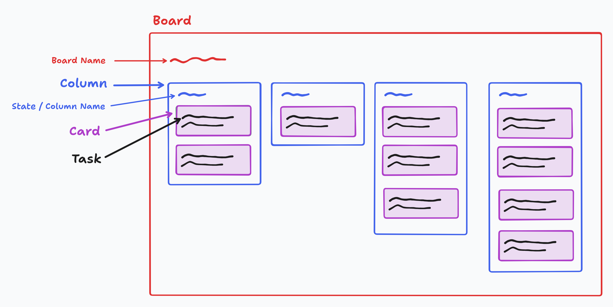
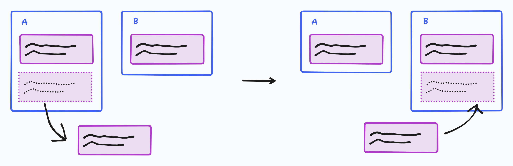
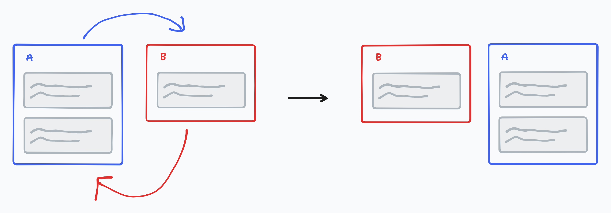
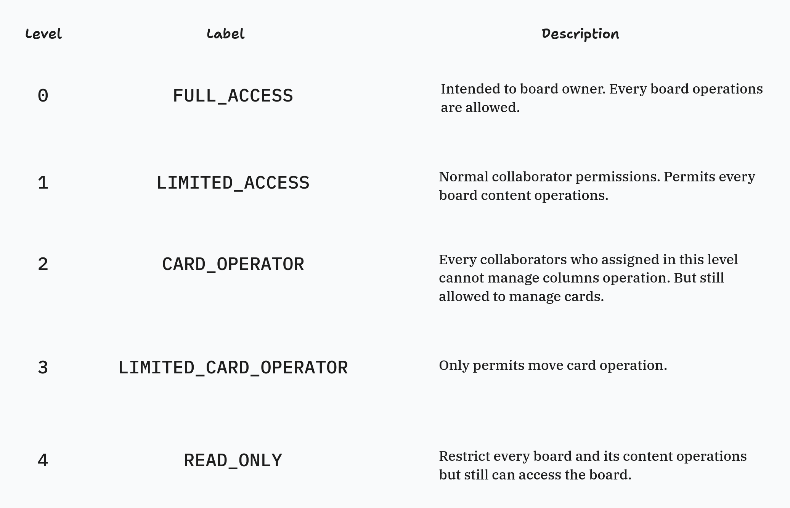
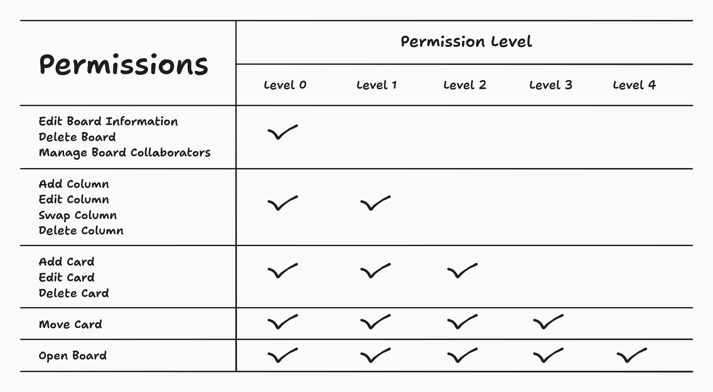
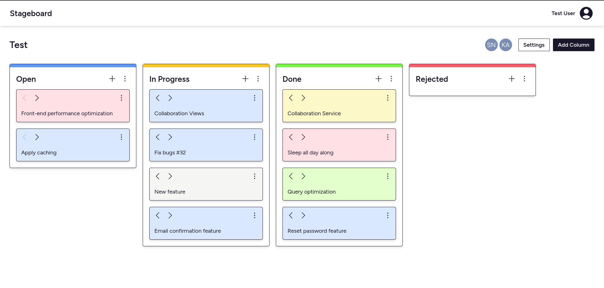
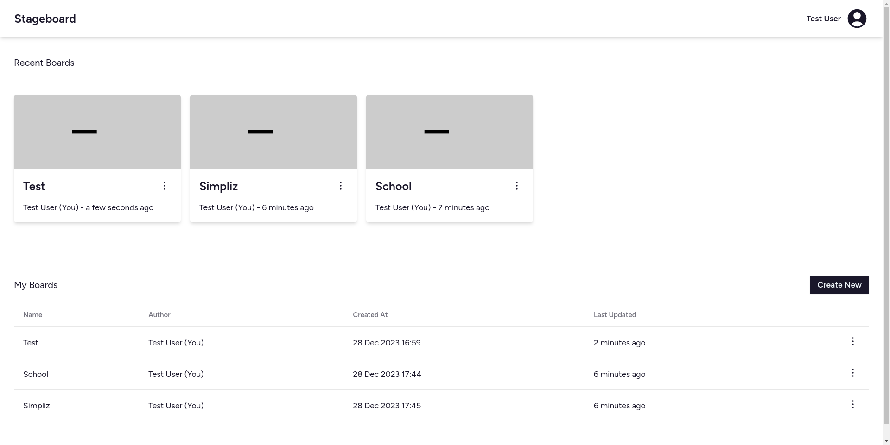
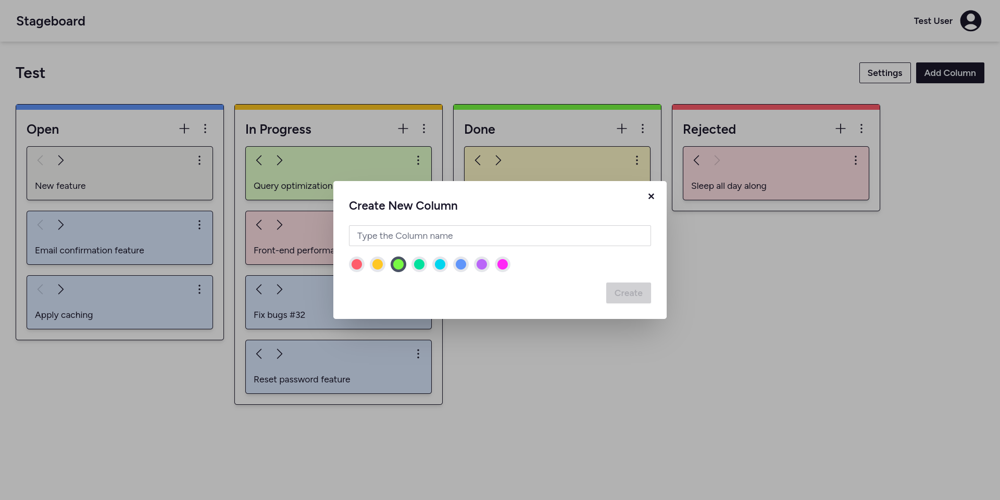

# Stageboard

Task management app just like kanban board

## Overview

Stageboard is a productivity tool app that can help you manage your task activity, like [kanban board](https://en.wikipedia.org/wiki/Kanban_board). Also, you can collaborate and share your tasks to others.

This project was built using [Laravel](https://laravel.com) and [ReactJS](https://react.dev/).

### Feature
- Board: You need a board to manage your tasks
- Column: Just like kanban, column is used to group your task into different state
- Card: This is your task that could be written to it.

- Move Card

- Swap Column Order

- Collaboration with **realtime** changes and permission management

## Installation
This project was built using Laravel 10, so this requires at least **PHP 8.1** version to running perfectly. And need these things to support its features:
- NodeJS v20
- Composer
- RDBMS server. Preferred: [MySQL](https://www.mysql.com/) or [MariaDB](https://mariadb.org/)
- WebSocket server. For example: [Soketi](https://soketi.app/)
- Mail server. Real or test.

You can follow this [Laravel deployment guide](https://laravel.com/docs/10.x/deployment) and make sure to compile Javascript assets for frontend stuff with `npm run build`.

## Screenshot Preview

- Board page

- Home page

- Creating new board

- Collaboration settings

- Profile settings

